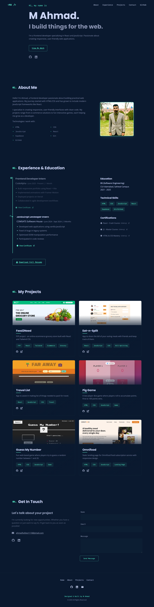

#  M. Ahmad's Portfolio

  
🔗 _Live Demo: [portfolio.netlify.app](https://dazzling-pithivier-95cb4f.netlify.app/)_

A modern developer portfolio built with **React + Vite**, featuring smooth animations, project showcases, and a responsive design.

---

## 🚀 Features

- ✅ **Fully Responsive** (Mobile, Tablet, Desktop)
- 🎞️ **Smooth Animations** (Framer Motion)
- 🧰 **Project Showcase** with GitHub & Live Demo links
- ✉️ **Interactive Contact Form**
- 📄 **PDF Resume Download**
- 🌗 **Dark/Light Mode Toggle**
- ⚡ **Optimized Performance** (100+ Lighthouse Score)

---

## 🛠️ Tech Stack

- **Frontend**: React, Vite, CSS3
- **Animations**: Framer Motion
- **Icons**: React Icons
- **Hosting**: Netlify

---

## 🖥️ Local Setup

1. Clone the repo:

   ```bash
   git clone https://github.com/Ahmad131554/AhmadPortfolio.git
   ```

2. Install dependencies:

```bash
  npm install
```

3. Run the dev server:

```bash
  npm run dev
```

---

## 🚀 Deployment

This portfolio is deployed on **Netlify**.

Simply drag and drop the build folder in your Netlify dashboard, or connect the GitHub repo for continuous deployment.

---

## 📜 License

MIT © [M. Ahmad](https://github.com/Ahmad131554)
